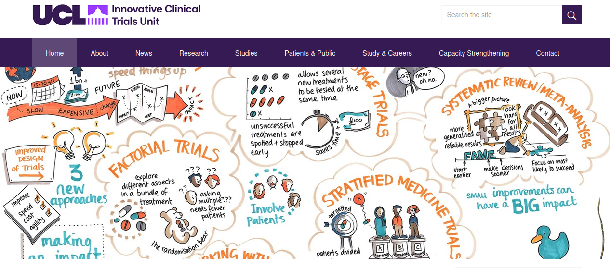

## Today's Talk

 - Brief Introduction (UCL ICTU, UCL ARC)
 - Code Translation Motivation
 - Code Translation Mechanics
 - Workshop Results

## Innovative Clinical Trials Unit and ARC

{fig-alt="A screenshot of the Innovative Clinical Trials Unit website" height="220"} 
{fig-alt="A plus sign" height="220"} 
{fig-alt="A screenshot of the Advanced Research Computing website, stating that ARC is UCL's research, innovation and service centre for the tools, practices and systems that enable computational science and digital scholarship." height="220"}

 - Experts in clinical trial design and analysis - statisticians.
   - Impact through successful clinical trials / publications.
   - A lot of software written in Stata.
 - Research software engineers
   - Collaboration to create impact through software.

## About Stata

 - Closed source commercial statistics software.
 - Supports community contribution with a package library and publication through the Stata journal.
 - Stata journal encourages good software practice - tests, documentation. 

## Motivation: Example artbin.

{fig-alt="A screenshot of the artbin publication in the Stata Journal titled artbin: Extended sample size for randomized trials with binary outcomes." height="440"}

## Motivation: Example artbin.

  - High quality software (including documentation and tests)
  - Demonstrated impact - used and cited in published trials.
  - Open source (GPL3) - free to download/modify
    - need Stata License to run.
  - Stata community is tiny compared to R or Python.
  - Can we increase impact by translation. 

## Stata2R: Practicalities

 - Pre-requisites:  
   - Well written/documented/tested Stata code 👍
   - Language Expertise (Stata and R)
   - Domain Expertise (Statistics)
   - Time (funding)

 - Lets leverage advances in agent based code translation?

## Agentic Coding (Claude Code)
 
 - Users communicate in plain text (for example "translate artbin to R")
   - Non deterministic (stochastic sampling from many possible answers).
   - Will usually do what you ask, which may not be a good thing.
 - We developed the **Stata2R** plugin with 4 skills to limit the impact of non deterministic behaviour and unquestioning behaviour.
 - We delivered a 4 hour workshop to use the plugin.
 
## What's in a Plugin / Skill

[Skills are defined in markdown.](https://github.com/stata-translations/Stata2R/blob/main/stata-translation/skills/)

 - Plugins are collections of skills that are easy to install

    ```
    /plugins marketplace add https://github.com/stata-translations/Stata2R.git
    /plugin install stata-translation
    /reload-plugins
    /stata-translation:hello
    ```
 -  ```
    /stata-translation:translation-strategy

    ```
 -  ```
    /stata-translation:stata-to-pseudocode

    ```
 -  ```
    /stata-translation:pseudocode-to-r

    ```
 -  ```   
    /stata-translation:add-missing-tests

    ```


## Plugin Skill 1: Translation Strategy
 
 - Summarise the purpose of the library.
 - Is it worth translating? (existing R libraries, users etc)
 - Is the documentation and testing sufficient to enable a good translation.
 
## Plugin Skill 2: Stata to Pseudocode
 
 - Evidence that two stage translation creates better code.
 - Enables a human review step.
 - Use any documentation files (.sthlp) to inform the translation.
 - Ignore all files in the testing directory.
 
## Plugin Skill 3: Pseudocode to R
 
 - Use the pseudocode to create an R package.
 - Create automated tests.
 - Port Stata documentation and examples to R (create vignettes)
 - Port any dialogues (graphical user interfaces) to R.
 - Copy over licence file and create README, CONTRIBUTING, files etc.

## Plugin Skill 4: Add Missing Stata Tests to R
 
 - Port the Stata tests to R and confirm they pass.
 - Document Stata to R test correspondence and verify results.

## Developed a training program.

We developed and delivered a [Workshop](https://github.com/stata-translations/Stata2R/blob/main/docs/workshop.md) to  
10 statisticians aiming to:

  - Teach statisticians to use Claude to translate code.
  - Use statisticians to review the quality of resulting translations.
    - [Pre Workshop Surveys](https://forms.cloud.microsoft/Pages/ResponsePage.aspx?id=_oivH5ipW0yTySEKEdmlwuNcJ7ofdGhDpRexUha3NYhUMU5QQ000NVpFTVRKRTEzRDRCQ0w4V05XMS4u)
    - [Post work shop survey](https://forms.office.com/Pages/ResponsePage.aspx?id=_oivH5ipW0yTySEKEdmlwkgtFALcEfRKnhSRePBd-9dUQjI1SzdIT1pROVBHVDJSNDU3QUNZVTBGTiQlQCN0PWcu)


## Pre-Workshop: Stata and R Fluency

```{=html}
<iframe width="100%" height="100%" src="https://stata-translations.github.io/workshop-results/pre-stata-vs-r_fluency.html" title="X-Y plot of Stata vs R Fluency. No one was fluent in both."></iframe>
```

## Post-Workshop: Skills assessment (Target language quality).

```{=html}
<iframe width="100%" height="100%" src="https://stata-translations.github.io/workshop-results/post_model_target_language.html" title="The percieved quality of the translation, grouped my model variant."></iframe>
```

## Post-Workshop: Skills assessment Example (Time Taken).

```{=html}
<iframe width="100%" height="100%" src="https://stata-translations.github.io/workshop-results/post_model_time.html" title="The time taken to perform translation by model variant."></iframe>
```

## Post-Workshop: Concerns Work Cloud


```{=html}
<iframe width="100%" height="100%" src="https://stata-translations.github.io/workshop-results/post_concerns_wordcloud.html" title="A word cloud of answers to the post workshop question 'What concerns (if any) do you have with using large language models for code translation? Notabale answers include 'Fear of hidden errors' and 'Testing and output control'"></iframe>
```

## Post-Workshop: Ideas for Improvements / Future Work.

```{=html}
<iframe width="100%" height="100%" src="https://stata-translations.github.io/workshop-results/post_improvements.html" title="A word cloud of answers to the question "What improvements would you suggest? Most respondonts wanted to see more work on 'verifying correctness'"></iframe>
```
## Further Considerations

  - Ongoing development (do you plan on maintaining both versions?)
  - Are you complying with the original license?
  - Who owns the copyright?
  - Preventing access to sensitive data.

## Summary

  - Claude can translate code.
  - Results are non deterministic.
  - The plugin provides some structure, but human intervention is still required to keep Claude on track.

## With Thanks to:

  James Carpenter, Tra My Pham, Asif Tamuri, David Fisher, Matteo Quartagno, Carlos Diaz Montana, Ian White, Toby Thompson

  **Links:**

  Slides: [https://doi.org/10.5281/zenodo.22124100](https://doi.org/10.5281/zenodo.22124100)

  Workshop Results: [https://doi.org/10.5281/zenodo.22093626](https://doi.org/10.5281/zenodo.22093626)

  Stata2R Plugin: [https://github.com/stata-translations/Stata2R](https://github.com/stata-translations/Stata2R)

{fig-alt="Link to https://stata-translations.github.io/talks-stata-conference/" height="240"}

